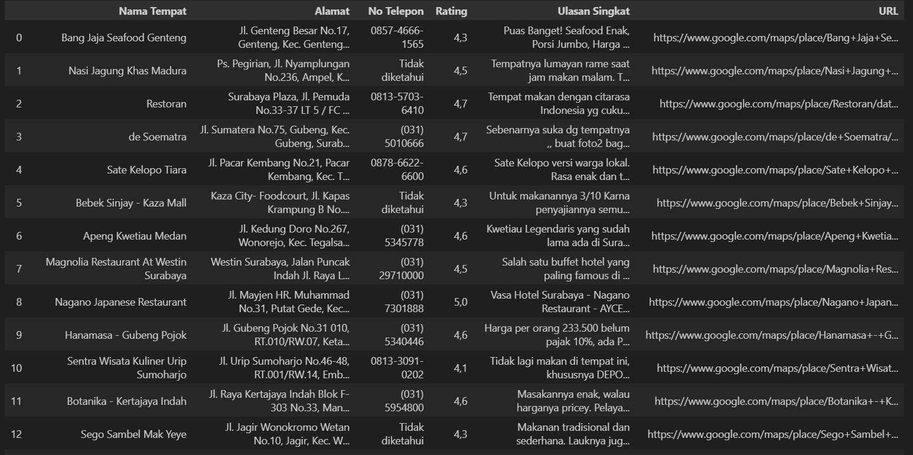

# Google Maps Restaurant Data Scraper

## 📌 Project Overview
Proyek ini mengambil data restoran dari Google Maps menggunakan Python dan Selenium.
Tujuannya adalah untuk mengumpulkan informasi terstruktur untuk analisis data.

## 📊 Data yang Dikumpulkan
- Nama Restoran
- Alamat
- Nomor Telepon
- Peringkat
- Ulasan Pelanggan Singkat
- URL Google Maps

## 🛠️ Teknologi yang Digunakan
- Python
- Selenium
- Pandas

## ⚙️ Tantangan & Solusi
- Menangani ulasan yang dimuat secara bertahap dengan menavigasi ke tab Ulasan
- Mencegah data duplikat menggunakan URL sebagai pengidentifikasi unik
- Mengelola perubahan DOM dinamis dengan beberapa selektor
- Membersihkan nilai yang hilang atau tidak lengkap

## 📈 Contoh Output

## ⚠️ Penafian
Data dikumpulkan dalam lingkup terbatas dan tidak digunakan secara komersial.
